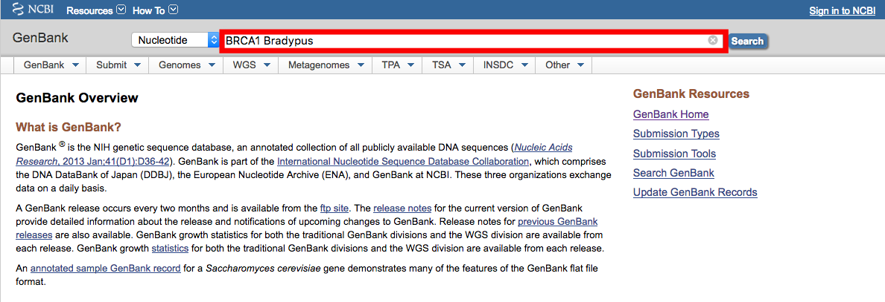
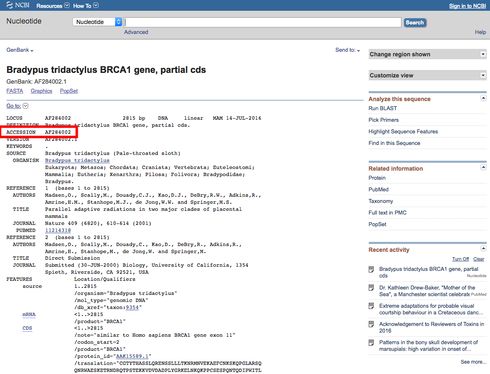
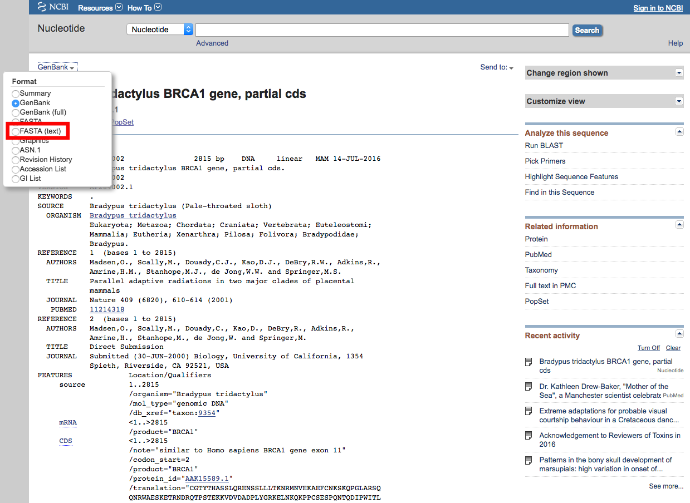
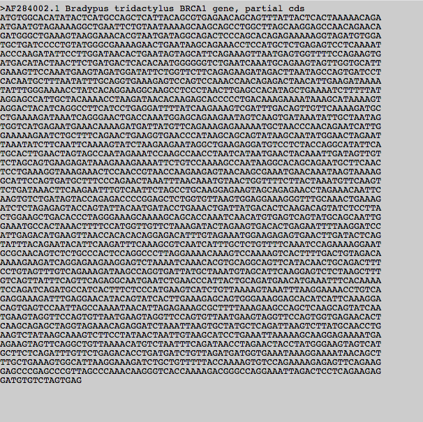
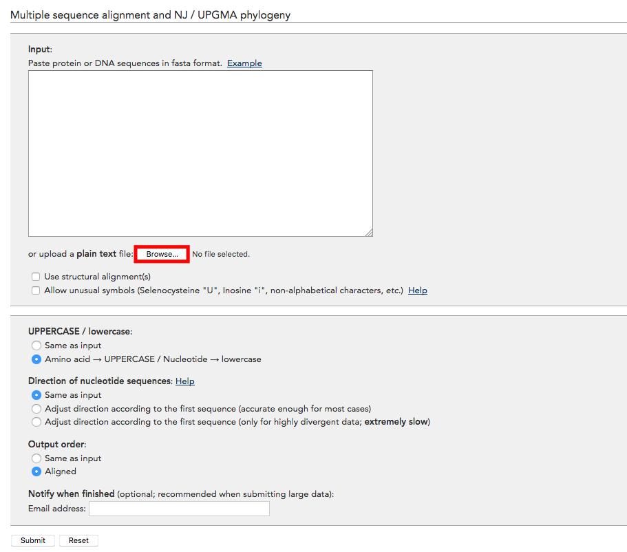
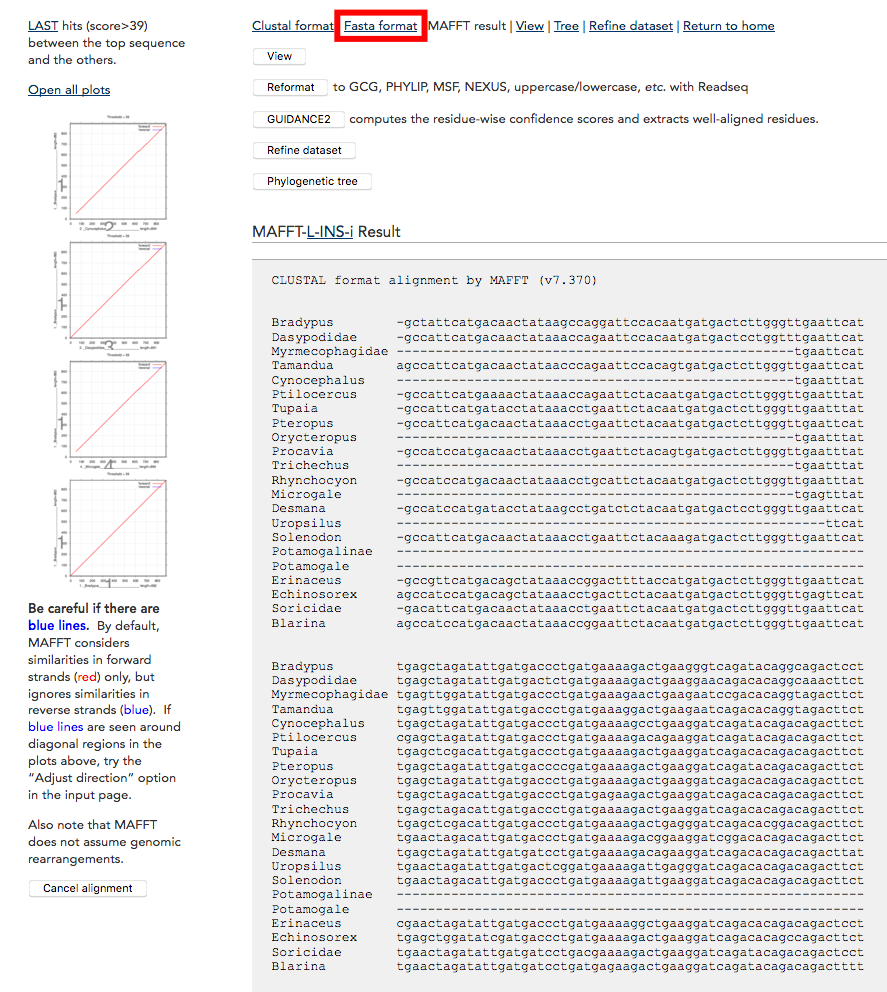

# Gene alignments: quick and dirty

Just before starting here are two best practices advices:

 * Bioinformatics can require editing raw text files (this tutorial will anyways), it is good to get yourself a decent text editor software. Word and all the similar _fancy_ ones **will not do**! I suggest using the base text editors from your OS (`KEdit`, `NotePad`, `Text Edit`) or downloading some more advanced ones like [TextWrangler](http://www.barebones.com/products/textwrangler/) (Mac only) or [Sublime](http://www.sublimetext.com/).
 * Bioinformatics can get pretty complicated. Not complicated in a technical way (the following tutorial is super easy) but complicated as in involving many steps. It is good practice to keep track of every step, either in a spreadsheet or as a _cooking recipe_ in a text file for example.


## First, collect your sequences

Go on [GenBank](https://www.ncbi.nlm.nih.gov/genbank/) and scan for the taxon and the sequence you're looking for.



You can use either just the gene name or just the taxon name but it's probably handier to use both.
When one match is available, you should access the sequence page that contains all the information about the match.
Sometimes, especially with model species, you can have access to multiple alleles of the sequence.
In this case, it's up to you to decide which one to use.
I always go with a simple rule of thumb and select the allele with the most nucleotides available.
Depending on which level of phylogeny you're tackling, it shouldn't be a big problem.

On this page, the most important information is the _accession number_.
That's the ID of this allele and this species.
It is important to report for reproducible research!
Note that you can use this ID directly in the searching tool bar to access the same page.



Otherwise, this page contains multiple information on who collected the sequence, where does it come from etc...
It might be relevant in some cases but can also totally be ignored!

To access the gene, we need to choose in which format to get the nucleotide.
One of the standard format is called `FASTA` (I don't remember what that stands for) and uses the following syntax:

```
>Taxon_name
ACGTACGTACGTACGTACGTACGTACGTACGTACGTACGTACGTACGT
ACGTACGTACGTACGTACGTACGTACGTACGTACGTACGTACGTACGT
ACGTACGTACGTACGTACGTACGTACGTACGTACGTACGTACGTACGT
ACGTACGTACGTACGTACGTACGTACGTACGTACGTACGTACGTACGT
```

Where the name of the taxon is indicated by a superior sign `>` and the nucleotide sequence comes directly after with a new line.
Note that case is ignored here so `atcg` is equal to `ATCG`.

You can download this `FASTA` sequence format by clicking on the FASTA link.



This should look something like that:



You can then copy/paste this sequence in a fasta file that will eventually contain all the taxa for the same gene.
Note that the taxon name can be edited.
In this case it is called:

```
>AF284002.1 Bradypus tridactylus BRCA1 gene, partial cds
```

Which can be slightly too long for the purpose of the study.
It can be shortened to just genus and species name for example (a good bioinformatic practice is to always write the genus and species names separated by an underscore).

```
>Bradypus_tridactylus
```

Note that this can be done automatically by writing a shell script using `sed` or any of your favourite equivalent but this is not going to be covered here (copy/paste/edit will do!).

You can repeat this step for each of your taxa for the same gene resulting in a file like this:

```
>Taxon_name1
ACGTACGTACGTACGTACGTACGTACGTACGTACGTACGTACGTACGT
...
ACGTACGTACGTACGTACGTACGTACGTACGTACGTACGTACGTACGT

>Taxon_name2
ACGTACGTACGTACGTACGTACGTACGTACGTACGTACGTACGTACGT
...
ACGTACGTACGTACGTACGTACGTACGTACGTACGTACGTACGTACGT

>Taxon_name3
ACGTACGTACGTACGTACGTACGTACGTACGTACGTACGTACGTACGT
...
ACGTACGTACGTACGTACGTACGTACGTACGTACGTACGTACGTACGT
```

Note that at this stage, genes are not aligned and can have different length.


## Second, align them

For the sequence alignment, it's also super easy: Gg on [MAFFT](https://mafft.cbrc.jp/alignment/server/) alignment online tool.



From there, you can upload your file with all the raw sequences (not aligned) for the different taxa.
There are several options for aligning your sequences, most of them having good default choices so you don't need to worry too much about how the sequences are aligned.
Anyways, whether you choose different options for matching your specific needs or you use all default, it is a good practice to still report each option used.
Please don't write a "_we used a default sequence alignment in MAFFT_" in your paper!
That's not helpful...

Once you're happy with your options (and have written them down), simply click on the `submit` button at the bottom of the page.
This should direct you to a page like this:



Here you'll have your sequence aligned with specific results on the alignments "fit".
Basically, if the plots on the right are diagonal red lines, you're not in too much troubles.
There is of course way more subtlety but they're not going to be covered here.

Once you're happy with your alignment, you can export it in the `FASTA` format (or actually any format you like using) and... You're done!
Repeat this task for any number of sequences you want to align!
Also, don't forget to cite this awesome tool in your paper.
The references can be found at the bottom of each pages.

### Cleaning up the results

Some sequences might have _unwanted_ nucleotides at the start/end of them.
For example, they could be some bits of micro-satellites included in the sequence (i.e. repetition of the same nucleotide), bits of the primer or any unwanted "trash" nucleotides leading to a lot of indels (`-`) at the start/end of the gene for the species with "cleaner" sequences.

You can remove these if you want as they add a lot of indels that will increase computational time when infering the phylogeny.
However, how to remove them is up to you (e.g. the X and Y first/last nucleotides were removed) and I strongly suggest never doing that by hand but through a proper repeatable shell/python script.

## Third, wrap them up in your favourite format

Finally, you might want/need to clean up your data and wrap it up in a different format.
For example, you might need to create a supermatrix (i.e. concatenating your genes together into one single sequence) and convert it into a format that would be read by your phylogenetic software (usually `NEXUS` format).

This can be do using online software or through a bit of shell/python scripting but again, I'm not going to delve further into details.

### File conversion

You can use this simple [File converter](http://sequenceconversion.bugaco.com/converter/biology/sequences/fasta_to_nexus.php) tool to quickly switch between `FASTA` and `NEXUS`.